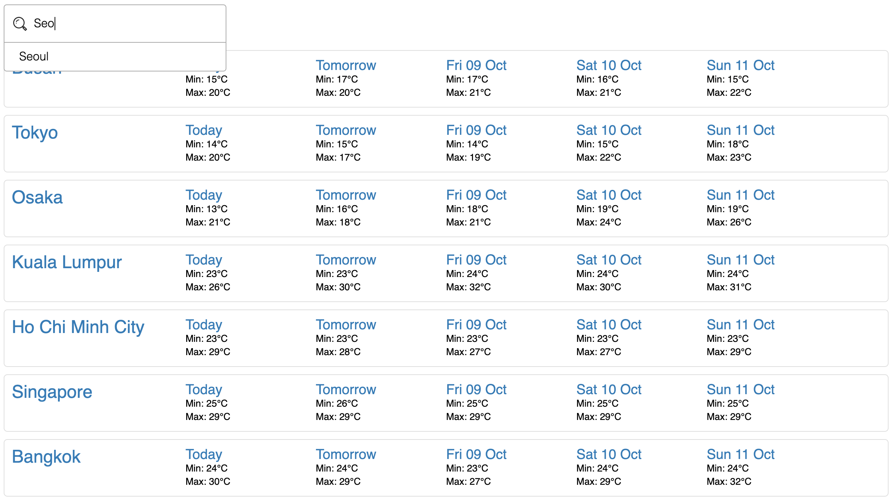

### Welcome to Weather Forecast application with features

1. Forecast weather status at cities over the world
2. Compare weather on your desired locations to make trip better

### How to use

1. Type city to search box and select one in suggested list
2. Weather on selected city will be shown in few seconds
3. Repeat step 1 to compare weather on different city

### How to start on your machine

1. `git clone https://github.com/binhfoto/nab-weather-forecast.git`
2. `cd nab-weather-forecast`
3. `yarn install`
4. `yarn start`  
   **Note:** yarn@1.22.4, node@v14.3.0

### How to run test

-   `yarn test`

### Technical Stack

| Name                                                                    | Description                      |
| ----------------------------------------------------------------------- | -------------------------------- |
| [Create React App](https://github.com/facebook/create-react-app)        | Scaffold project                 |
| React                                                                   | UI-based component               |
| Typescript                                                              | Strong type, Error Handling      |
| Redux                                                                   | State Management                 |
| Redux-saga                                                              | Handling side effects            |
| Jest                                                                    | Test framework                   |
| Enzyme                                                                  | Test React components            |
| [redux-saga-test-plan](http://redux-saga-test-plan.jeremyfairbank.com/) | Test sagas                       |
| [Prettier](https://prettier.io/)                                        | Opinionated Code Format          |
| husky                                                                   | Pre commit hook                  |
| API                                                                     | https://www.metaweather.com/api/ |

## What's good to have next

1. Show weather at current location by default
2. Allow to remove weather item on list
3. Show error friendly if having any
